# Detecção de fraude em e-commerce — Atividade de Especialização

Trabalho desenvolvido no contexto de uma disciplina de **Machine Learning aplicado à segurança**, como parte do curso de especialização. O repositório documenta a implementação técnica, os experimentos e os artefatos gerados para a entrega do **Desafio Prático**, com prazo em **08/07**.

---

## Contexto do problema

Uma empresa de e-commerce tem enfrentado um aumento significativo de fraudes em transações online. Os ataques variam desde uso indevido de cartões de crédito até criação de contas falsas para explorar promoções. O setor de segurança precisa de soluções inteligentes que consigam identificar padrões suspeitos e agir de forma preventiva.

**Problemas identificados:**

- O volume de transações é muito alto, dificultando a análise manual.
- As tentativas de fraude evoluem constantemente, tornando modelos estáticos pouco eficazes.
- Há forte desbalanceamento de classes: a maioria das transações é legítima, e apenas uma pequena fração corresponde a fraudes.

**O que foi solicitado:**

- Analisar dados disponíveis sobre transações e ataques.
- Selecionar técnicas de ML adequadas para detectar anomalias e classificar riscos.
- Propor métricas para avaliar desempenho (precisão, recall, F1-score).
- Elaborar plano de implementação que inclua monitoramento contínuo e atualização do modelo.

---

## Avaliação

| Item | Descrição |
|---|---|
| **Formato** | Avaliação Desafio Prático |
| **Prazo de entrega** | 08/07 |
| **Competência avaliada** | Avaliar a capacidade de aplicar técnicas de ML para resolver problemas reais de segurança |

### Rubrica

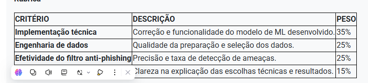

| Critério | Descrição | Peso |
|---|---|---:|
| Implementação técnica | Correção e funcionalidade do modelo de ML desenvolvido | 35% |
| Engenharia de dados | Qualidade da preparação e seleção dos dados | 25% |
| Efetividade do filtro anti-phishing | Precisão e taxa de detecção de ameaças | 25% |
| Documentação | Clareza na explicação das escolhas técnicas e resultados | 15% |

---

## Fonte de dados

As informações utilizadas foram obtidas a partir do [Fraud Dataset Benchmark (FDB)](https://github.com/amazon-science/fraud-dataset-benchmark), mantido pela Amazon Science. O benchmark reúne datasets públicos de fraude e permite comparar abordagens em cenários reais de desbalanceamento.

Neste trabalho, utilizamos três fontes do FDB:

| Dataset | Uso no projeto |
|---|---|
| `fraudecom` | Transações de e-commerce, cadastro, dispositivo, IP e comportamento de conta |
| `malurl` | URLs benignas e de phishing para o filtro anti-phishing |
| `ccfraud` | Transações de cartão de crédito com taxa de fraude de ~0,17% |

---

## Abordagem adotada

Optamos por um pipeline reprodutível em Python, organizado em camadas (domínio, aplicação, infraestrutura e interface CLI), em vez de um notebook isolado. As principais decisões técnicas foram:

1. **Split temporal** (70% treino / 15% validação / 15% teste) para evitar vazamento de informação futura.
2. **Tratamento de desbalanceamento** com `class_weight=balanced` e avaliação por PR-AUC e F1, não apenas acurácia.
3. **Calibração de threshold** na validação, com recall mínimo definido por componente.
4. **Filtro anti-phishing dedicado**, com métricas próprias separadas do modelo transacional.
5. **Cascata em 2 estágios para cartão** (gatekeeper de alto recall + especialista de alta precisão), diante da impossibilidade matemática de separação perfeita com um único limiar.
6. **Monitoramento e retreino por gatilho** de drift e queda de performance.

---

## Resultados principais

### Fraude transacional (e-commerce — `fraudecom`)

| Métrica | Valor |
|---|---:|
| Modelo selecionado | Regressão logística balanceada |
| Precision | 0,073 |
| Recall | 0,743 |
| F1 | 0,133 |
| ROC-AUC | 0,753 |
| PR-AUC | 0,371 |

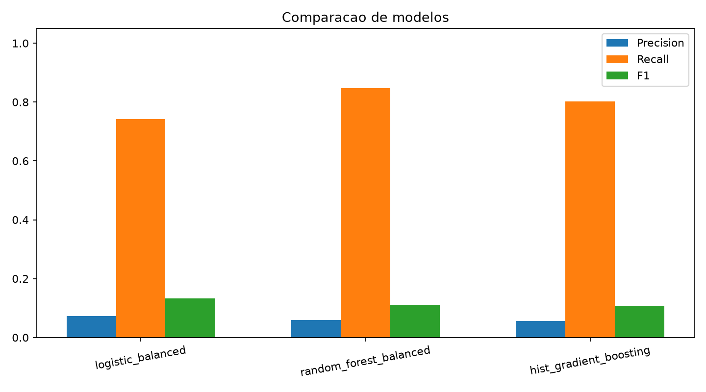

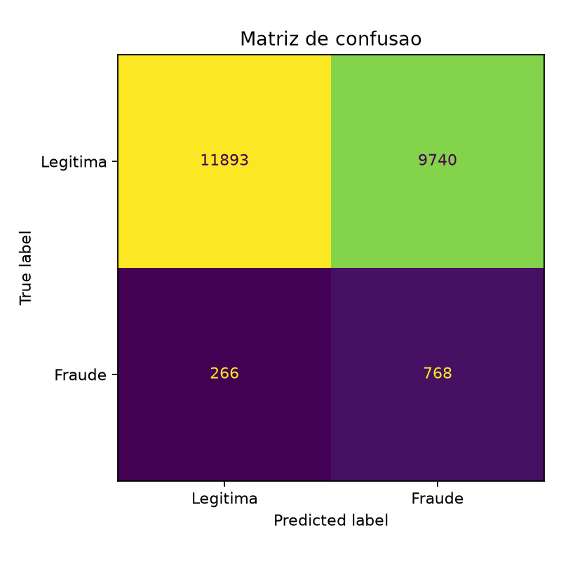

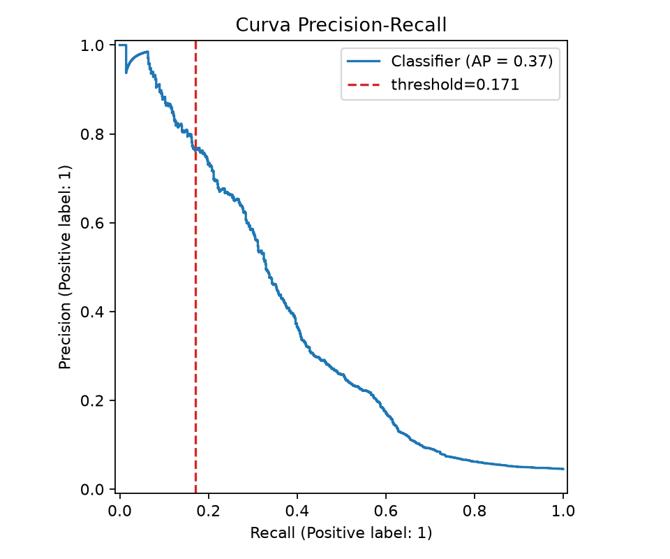

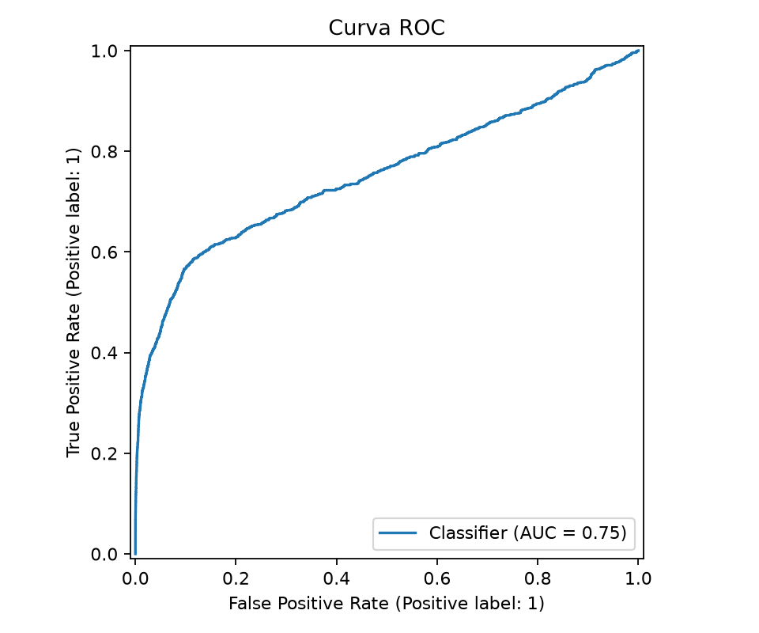

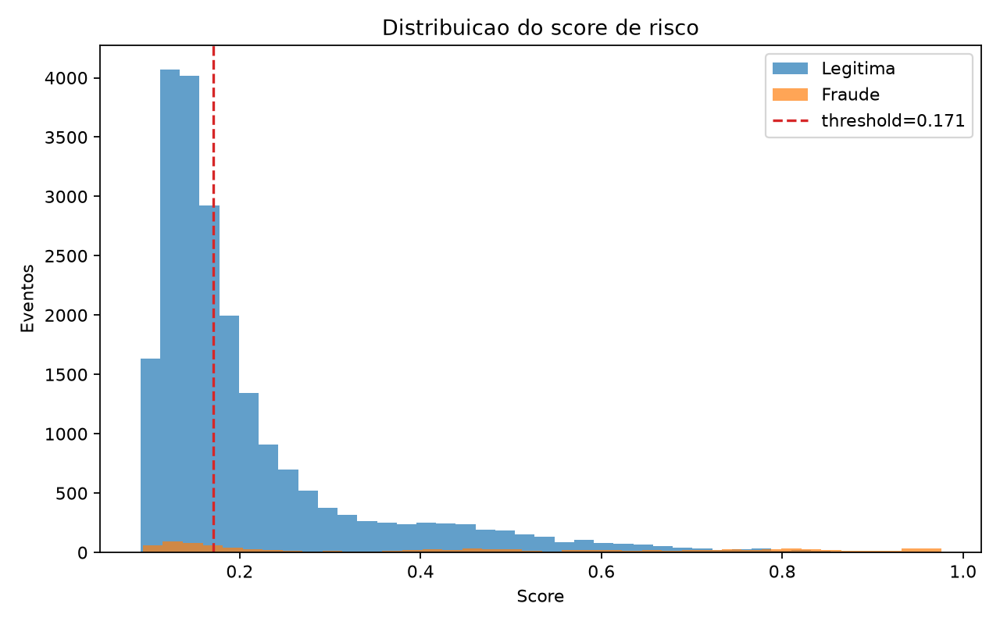

### Filtro anti-phishing (`malurl`)

| Métrica | Valor |
|---|---:|
| Precision | 0,939 |
| Recall | 0,943 |
| F1 | 0,941 |

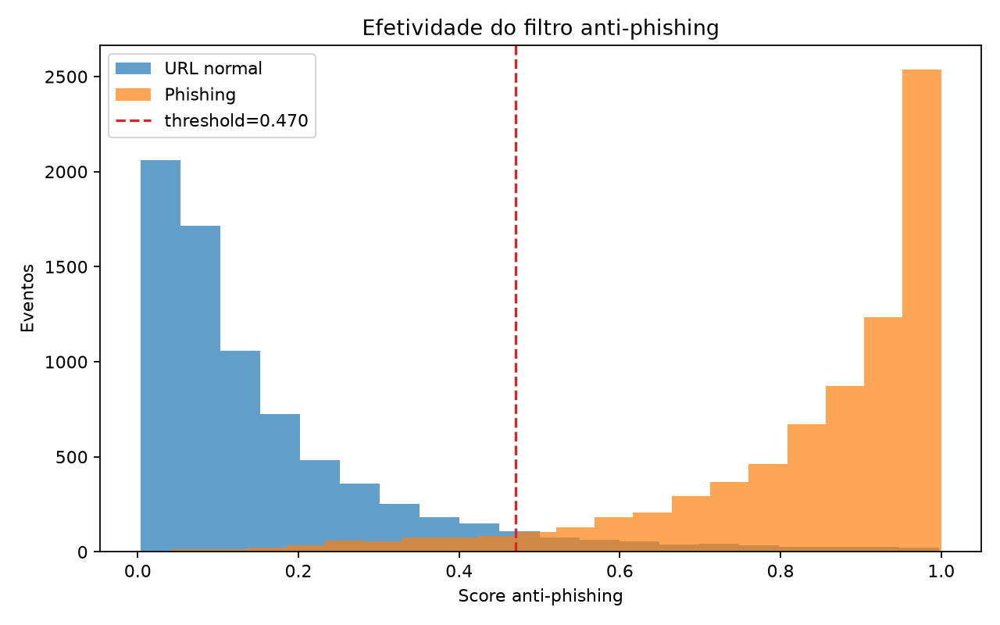

### Uso indevido de cartão (`ccfraud`)

Para cartão, um único threshold com recall 100% gerou **15.725 falsos positivos** no teste. A cascata em 2 estágios reduziu esse número para **22**, mantendo **100% das fraudes** no funil de risco (bloqueio ou revisão manual).

| Política | Recall bloqueio | Recall com revisão | Precision | Falsos positivos |
|---|---:|---:|---:|---:|
| Single-stage (logistic) | 1,000 | 1,000 | 0,003 | 15.725 |
| Cascata 2 estágios | 0,750 | 1,000 | 0,639 | 22 |

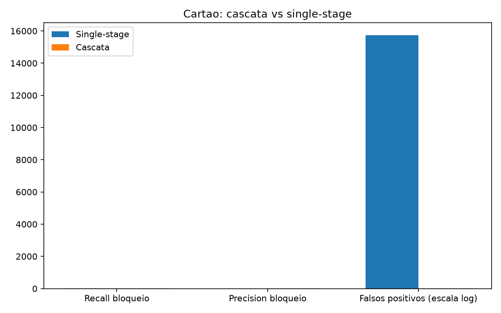

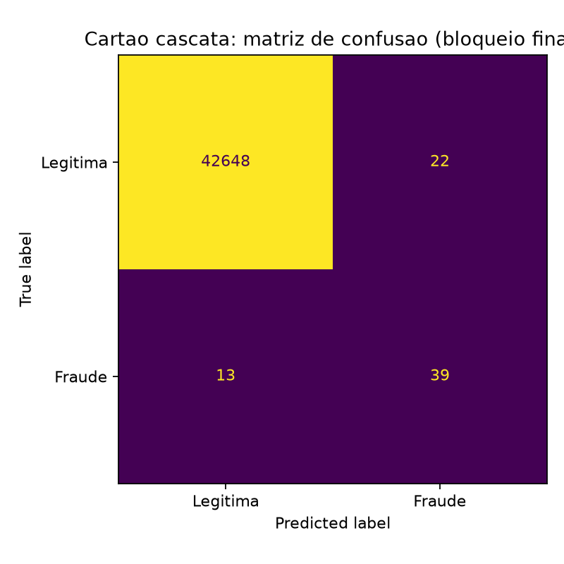

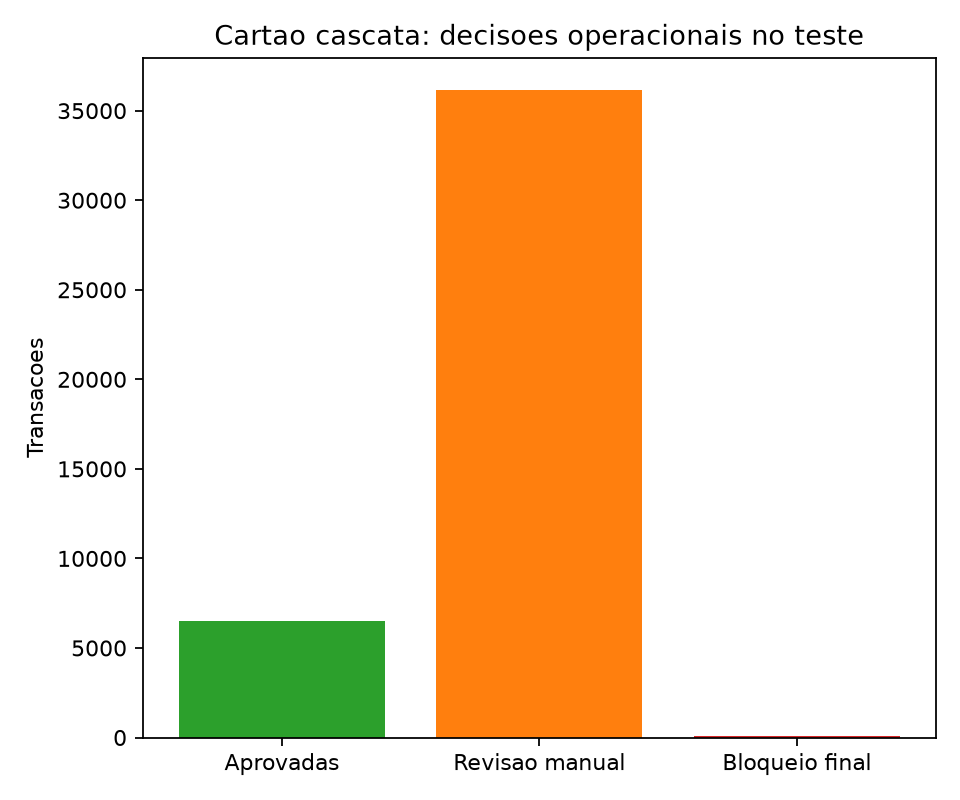

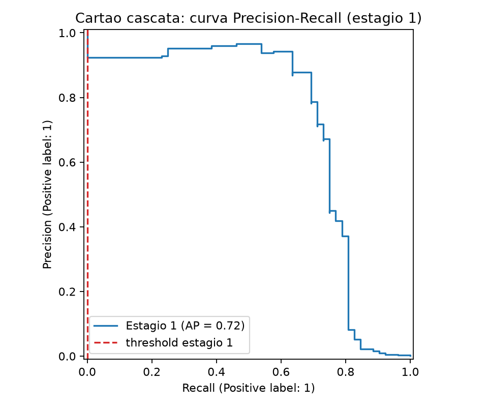

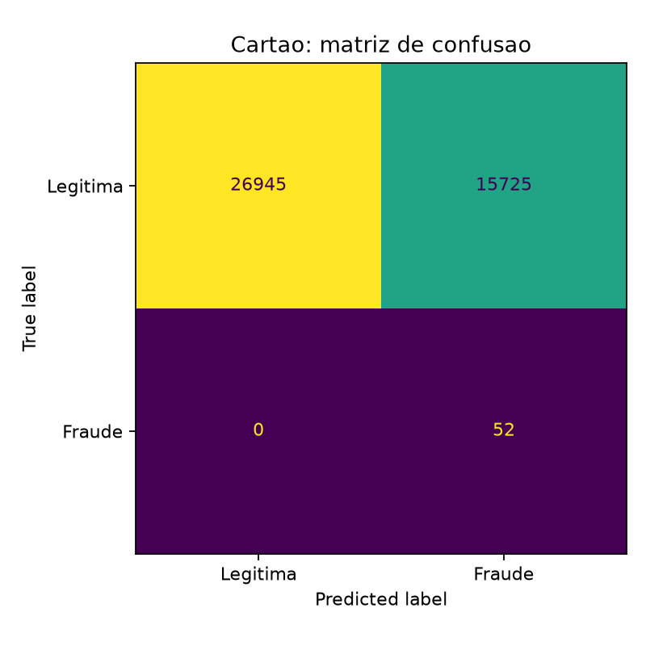

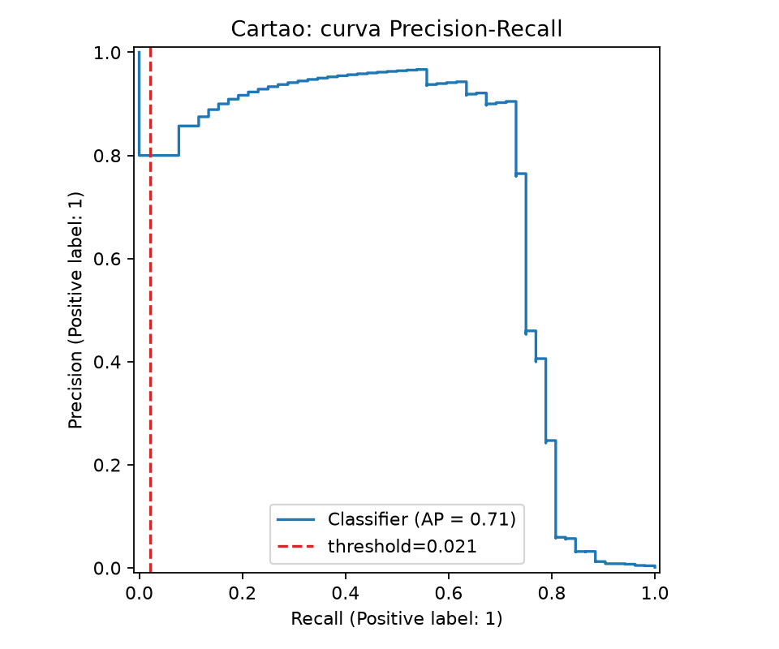

### Abuso promocional e contas falsas

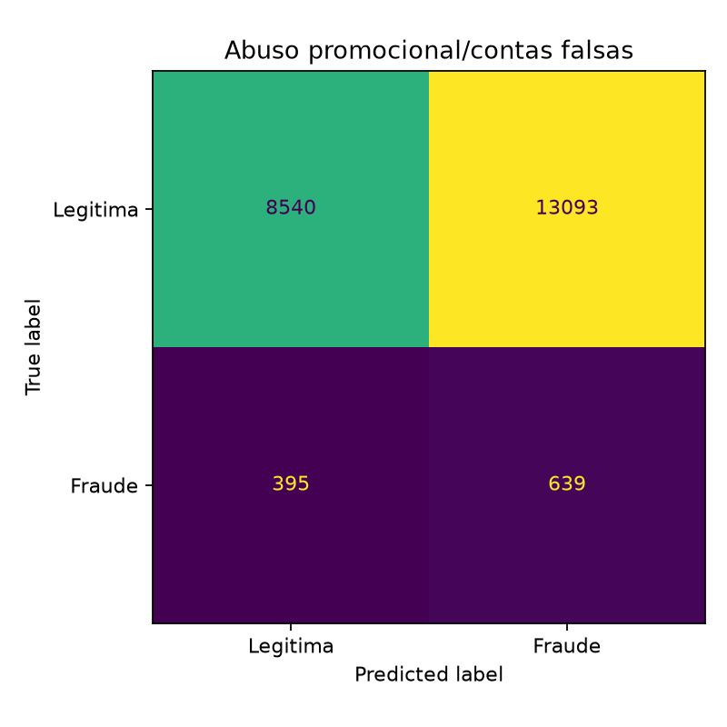

### Limites de separação (confiança do modelo)

Análise que demonstra que **não existe um único threshold capaz de capturar 100% das fraudes com zero falsos positivos** nestes datasets — o que justifica a política operacional de `block_or_step_up` e revisão manual, em vez de bloqueio definitivo automático.

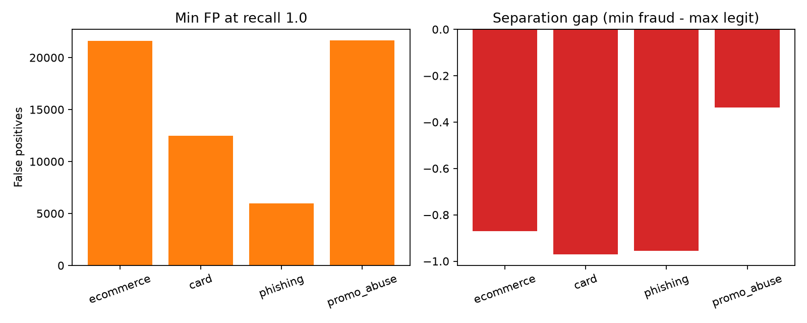

---

## Como executar

Requisitos: Python 3.10+ e ambiente virtual.

```bash
python -m venv .venv
.venv\Scripts\activate
pip install -r requirements.txt
python scripts/download_fdb_sources.py
python src/fraud_detection_pipeline.py --output-dir artifacts
```

### Avaliação por componente

```bash
python scripts/evaluate_card_misuse.py --output-dir artifacts --min-recall 1.0
python scripts/evaluate_card_cascade.py --output-dir artifacts
python scripts/evaluate_promo_abuse.py --output-dir artifacts
python scripts/analyze_score_separation.py --output artifacts/system_trust_report.json
```

### Simulações operacionais

```bash
python scripts/simulate_online_purchase.py --model-dir artifacts
python scripts/simulate_checkout_api.py --model-dir artifacts
```

### Monitoramento e atualização

```bash
python scripts/monitor_model.py --model-dir artifacts
python scripts/update_model.py --model-dir artifacts
python scripts/backtest_temporal_drift.py --model-dir artifacts
```

Os artefatos gerados (modelos, métricas e gráficos completos) ficam em `artifacts/` após a execução. Essa pasta não é versionada no Git por conter arquivos binários e resultados de execução local.

---

## Estrutura do projeto

```text
src/fraud_risk/
  domain/           Regras de negócio: features, métricas, política anti-phishing
  application/      Caso de uso: treino, seleção de modelo, avaliação
  infrastructure/   Pandas, scikit-learn, persistência, cascata de cartão
  interfaces/       CLI

scripts/            Download FDB, avaliação, simulações, monitoramento
assets/graficos/    Gráficos referenciados neste README
data/raw/           Datasets baixados do FDB (após download)
```

---

## Plano de implementação em produção

1. **Ingestão** — eventos de compra, cadastro, dispositivo, IP, pagamento, promoção e URL de origem.
2. **Qualidade** — validação de schema, nulos, duplicados e drift de distribuição.
3. **Treinamento** — benchmark com FDB; calibração final com dados internos rotulados.
4. **Deploy** — serviço de scoring com faixas de decisão (aprovar / step-up / bloquear).
5. **Monitoramento** — precision, recall estimado, taxa de bloqueio, PR-AUC, PSI e drift categórico.
6. **Atualização** — retreino semanal ou por gatilho; feedback de revisão humana como novo rótulo.
7. **Segurança** — versionamento de modelo, auditoria de decisões e regras de fallback.

---

## Galeria completa de gráficos

Todas as imagens geradas nos experimentos, disponíveis em `assets/graficos/`:

### Rubrica


### E-commerce (`fraudecom`)


### Anti-phishing (`malurl`)


### Cartão de crédito (`ccfraud`)


### Abuso promocional


### Confiança e separação de scores


---

## Referências

- [Fraud Dataset Benchmark — Amazon Science](https://github.com/amazon-science/fraud-dataset-benchmark)
- scikit-learn — classificação supervisionada, calibração e métricas para classes desbalanceadas
